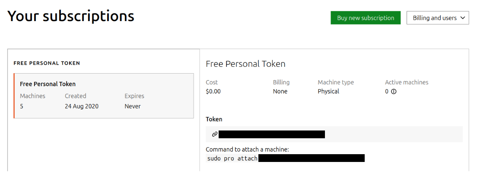

.. _attach-tutorial:

Tutorial: Start using Ubuntu Pro
================================

Overview
~~~~~~~~

In this tutorial you will learn how to find your Ubuntu Pro token and how to attach it to an Ubuntu LTS machine.

Note that this tutorial is for Ubuntu machines with internet access. Customers with a paid Ubuntu Pro subscription who need to set up Ubuntu Pro on airgapped machines should review `Ubuntu Pro for airgapped environments <https://documentation.ubuntu.com/pro/airgapped-setup/>_`.

What you’ll learn
~~~~~~~~~~~~~~~~~

1. How to retrieve your Ubuntu Pro token and attach it to your Ubuntu LTS machine/s
2. How to check for and apply security updates on your Ubuntu machine, including security updates for Ubuntu Universe packages which are only available with Ubuntu Pro

What you’ll need
~~~~~~~~~~~~~~~~

1. An Ubuntu Pro subscription - free or paid - with access to the `Ubuntu Pro dashboard <https://ubuntu.com/pro/dashboard>_` already set up. If you have not done so, review the steps under Initial account setup https://documentation.ubuntu.com/pro/account-setup/
2. An Ubuntu machine running any LTS version of Ubuntu from 16.04 onwards
3. Sudo access
4. Ubuntu Pro client
5. Internet access 

Before we start
~~~~~~~~~~~~~~~

Make sure that the Ubuntu Pro client is installed and up to date:

.. code-block:: bash

   $ sudo apt install ubuntu-advantage-tools

When you get the latest client, run apt update again to make sure all package data is up to date.

.. code-block:: bash

   $ sudo apt update

Check or create your Ubuntu Pro subscription
~~~~~~~~~~~~~~~~~~~~~~~~~~~~~~~~~~~~~~~~~~~~

Log in to the `Ubuntu Pro dashboard <https://ubuntu.com/pro/dashboard>`_.

You access your Ubuntu Pro token from the Ubuntu Pro dashboard. Make sure you have followed the steps under `Initial account setup <https://documentation.ubuntu.com/pro/account-setup/>`_ to log in to this dashboard.

Next, retrieve the token under ‘Your subscriptions’:

.. Important::

   For individual desktop, VM and physical server subscriptions, you attach your token directly on your machines. For customers who have licensed an entire virtual cluster at the physical host level, use the token on the subscription labelled “physical” on your virtual machines. There is no need to use the token on the physical hosts.

Attach your Ubuntu LTS machine to an Ubuntu Pro subscription
~~~~~~~~~~~~~~~~~~~~~~~~~~~~~~~~~~~~~~~~~~~~~~~~~~~~~~~~~~~~

Now that we have our Ubuntu Pro token, we can attach it to our Ubuntu instance. Open the terminal on your Ubuntu LTS, and type the following command:

.. code-block:: bash
   
   sudo pro attach [YOUR_TOKEN]

Some of the Ubuntu Pro services are automatically enabled while others remain disabled until you switch them on:

.. code-block:: bash

   $ sudo pro attach [YOUR_TOKEN]
   Enabling default service esm-infra
   Updating package lists
   Ubuntu Pro: ESM Infra enabled
   Enabling default service livepatch
   Canonical livepatch enabled.
   This machine is now attached to 'Ubuntu Pro - free personal subscription'

   SERVICE          ENTITLED  STATUS    DESCRIPTION
   esm-apps         yes       enabled   Expanded Security Maintenance for Applications
   esm-infra        yes       enabled   Expanded Security Maintenance for Infrastructure
   fips             yes       disabled  NIST-certified core packages
   fips-updates     yes       disabled  NIST-certified core packages with priority security updates
   livepatch        yes       enabled   Canonical Livepatch service
   usg              yes       disabled  Security compliance and audit tools

   NOTICES
   Operation in progress: pro attach

   Enable services with: pro enable <service>
   Account: [YOUR_EMAIL]
   Subscription: Ubuntu Pro - free personal subscription

This output depends on your Ubuntu LTS version, for instance ‘fips’, ‘fips-updates’ and ‘usg’ may not be available for the newest LTS version of Ubuntu.

Congratulations - Ubuntu Pro is now enabled on your machine
~~~~~~~~~~~~~~~~~~~~~~~~~~~~~~~~~~~~~~~~~~~~~~~~~~~~~~~~~~~

Well done! Your machine now has access to Ubuntu Pro repositories. That means that every time you update your software, you will be pulling from the Ubuntu Pro’s Expanded Security Maintenance repositories. You can get it through all the usual paths; nothing new to learn. You can use unattended-upgrades, the Software Updater on the Desktop, apt upgrade command in the CLI, or `Landscape <https://documentation.ubuntu.com/pro/landscape/>`_.

To ensure that all available CVE fixes are applied, run:

.. code-block:: bash

   $ sudo apt update && sudo apt upgrade

That’s all, folks
~~~~~~~~~~~~~~~~~

Good job, you made it! You should now know how to access and use Ubuntu Pro.

For instructions on how to enable specific services, review the `Ubuntu Pro client documentation <https://documentation.ubuntu.com/pro-client/en/latest/howtoguides/enable_index/>_`.

