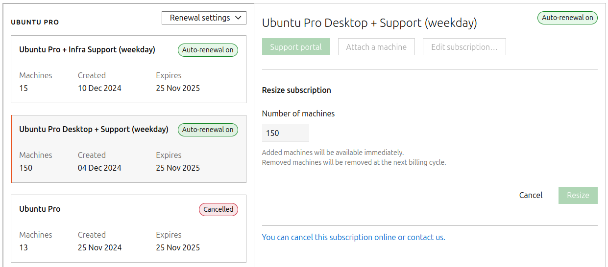

.. _subscription_management:

Manage or renew your Ubuntu Pro subscription online
===================================================

If you are an online shop customer, you can manage and renew your Ubuntu Pro subscription on the `Ubuntu Pro dashboard <https://ubuntu.com/pro/dashboard>`_.
 
.. Important::
   
   You must be either an administrator or billing user in order to make changes to your Ubuntu Pro subscription.

Add or remove seats
-------------------

To increase or decrease the number of machines in your subscription, select the subscription you wish to manage, then click *Edit subscription*. Update the quantity as required.

Renew your subscription
-----------------------

Your subscription will automatically renew on its expiry date. You can check and update your renewal settings on the *Renewal settings* menu, for example, if your organisation does not allow auto-renewal.

To renew your subscription after it has expired, log in to the `Ubuntu Pro dashboard <https://ubuntu.com/pro/dashboard>`_ and click *Renew subscription*. Alternatively, you can purchase a new subscription via the `online shop <https://ubuntu.com/pro/subscribe>`_.

.. Important::

   Make sure that your payment method is up to date. To update your credit card information, go to *Payment Methods* on the `Ubuntu Pro dashboard <https://ubuntu.com/pro/dashboard>`_.
   
Cancel your subscription
------------------------

To cancel a subscription, click *Edit subscription*, then click the hyperlink at the bottom of the module, “You can cancel this subscription online or contact us.” Note that cancelling a subscription means it will not automatically renew. Your subscription will remain active until its expiry date.

Manage your payment method
--------------------------

If you need to update or add a new payment method, click the menu button *Billing and users* above *Your subscriptions* in the Ubuntu Pro dashboard, then select *Payment methods*:

.. image:: images/dashboard-menu-button

Edit or add a new card as required.

Manage your account details
---------------------------

If you need to update your billing address, VAT number or other account details, click the menu button *Billing and users* above *Your subscriptions* in the Ubuntu Pro dashboard, then select *Invoices*.

On the Invoices page, click *Edit billing details* and update your information as required.

For all other customers
-----------------------

If you purchased Ubuntu Pro through an Account Manager or reseller and want to update or renew your subscription, please get in touch with them directly. If you cannot find their details, contact Customer Success for assistance.

The contact details for Customer Success are in the original “Welcome to Ubuntu Pro” message we sent you. If you cannot find the welcome message, go to `https://ubuntu.com/ <https://ubuntu.com/>`_ and ask for Customer Success contact details using the LiveChat service.

