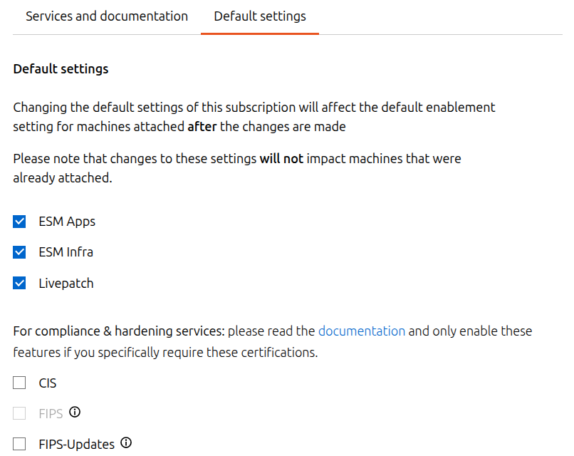

.. _update-token:

How to update your Ubuntu Pro token
===================================

If you change the tier of Ubuntu Pro to which you are subscribed, your Ubuntu Pro token will change too. This guide explains how to update the token on your Ubuntu machines while ensuring that the same Ubuntu Pro tools remain enabled as before.

Determine which Ubuntu Pro tools are in use in your environment
---------------------------------------------------------------

Check which Ubuntu Pro tools are enabled in your environment:

.. code-block:: bash

   pro status

 You will get an output like this:

.. code-block:: bash

   SERVICE          ENTITLED  STATUS       DESCRIPTION
   esm-apps         yes       enabled      Expanded Security Maintenance for Applications
   esm-infra        yes       enabled      Expanded Security Maintenance for Infrastructure
   fips-updates     yes       disabled     FIPS compliant crypto packages with stable security updates
   landscape        yes       enabled      Management and administration tool for Ubuntu
   livepatch        yes       enabled      Canonical Livepatch service
   realtime-kernel* yes       disabled     Ubuntu kernel with PREEMPT_RT patches integrated
   usg              yes       disabled     Security compliance and audit tools

Take note of the enabled services. In the above output, for example, I can see that ESM apps and infra, Landscape and Livepatch are enabled.

Update the Default settings for your new Ubuntu Pro token
---------------------------------------------------------

Log in to the `Ubuntu Pro dashboard <https://ubuntu.com/pro/dashboard>`_ and select your new subscription.

From there, navigate to *Default settings* and update the default tools to match the output from the previous step:

If we continue with my own example, I would set ESM apps and infra and Livepatch as default tools.

Landscape does not need to be set as a default tool because any Landscape registration will remain valid as long as an active Ubuntu Pro token is present on the registered machine.

Update the Ubuntu Pro token on a test machine
---------------------------------------------

Copy your new Ubuntu Pro token from the Ubuntu Pro dashboard, then apply it to a test machine:

.. code-block:: bash

   sudo pro detach && sudo pro attach NEW_TOKEN

For machines registered to Landscape, you should also restart Landscape client:

.. code-block:: bash

   sudo systemctl enable landscape-client
   sudo systemctl start landscape-client

Verify that the correct tools are enabled by rerunning <pro status>.

Update the Ubuntu Pro token across your Ubuntu estate
-----------------------------------------------------

Proceed with applying your new Ubuntu Pro token across your remaining Ubuntu machines:

.. code-block:: bash

   sudo pro detach && sudo pro attach NEW_TOKEN
   
As above, for machines registered to Landscape we also want to restart Landscape client:

.. code-block:: bash

   sudo systemctl enable landscape-client
   sudo systemctl start landscape-client

If you need to update the token on lots of machines at once, you can run these commands using `Landscape’s scripts functionality <https://documentation.ubuntu.com/landscape/explanation/features/remote-script-execution/>`_ or any other scripting tool in use in your Ubuntu environment.

